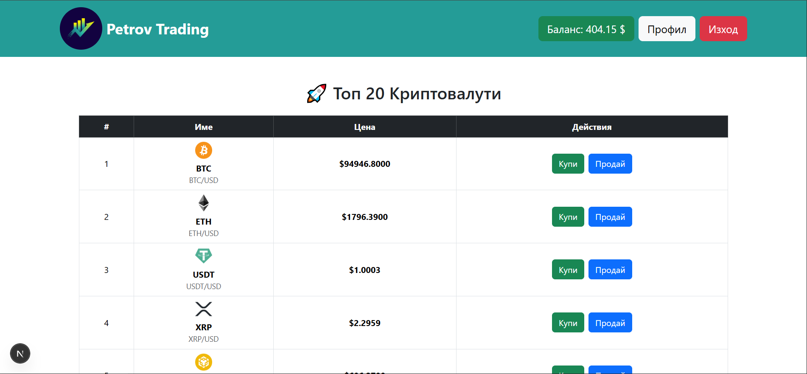
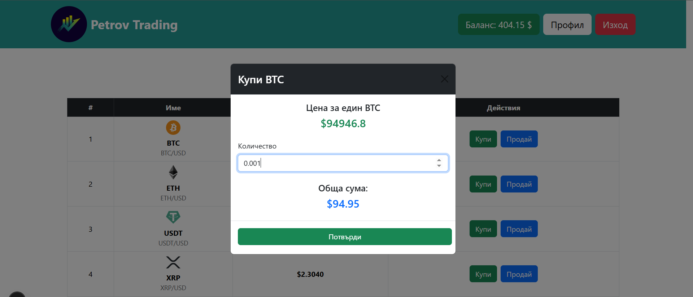
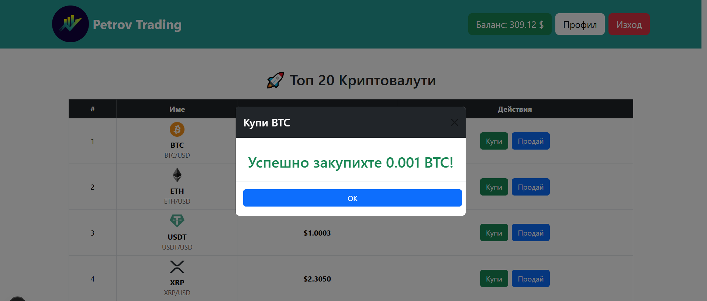
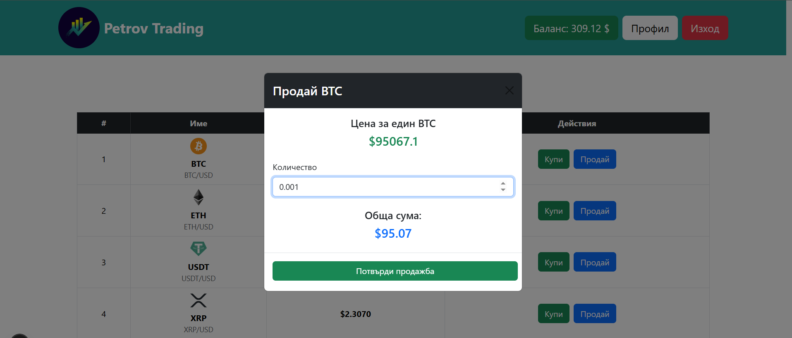
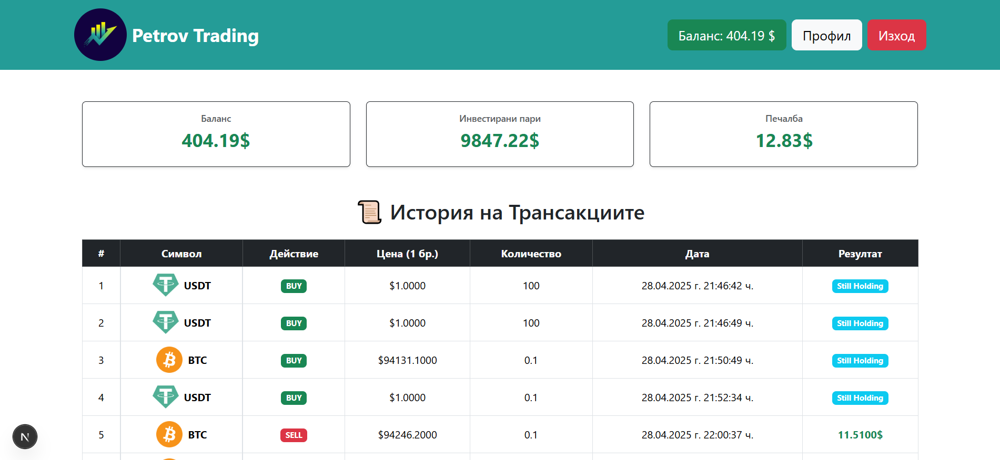
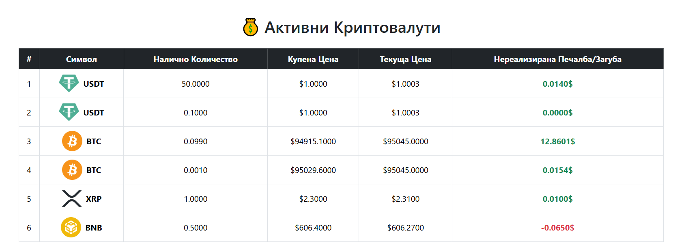

## 🖥️ Landing Page

This is the first screen users see when they access the application.

---

## 💰 Buy Crypto - Step One

The user selects a cryptocurrency to purchase.

---

## 🔁 Balance Update After Buying

After confirming the transaction, the user's balance is updated.

---

## 📤 Sell Crypto - Step One

The user chooses a position to sell.

---

## 🔁 Balance Update After Selling

Balance gets updated again after the sell operation.

---

## 🧾 Transaction History

Users can review their complete transaction log.

---

## 📊 Active Positions

Shows all active crypto positions a user currently holds.

